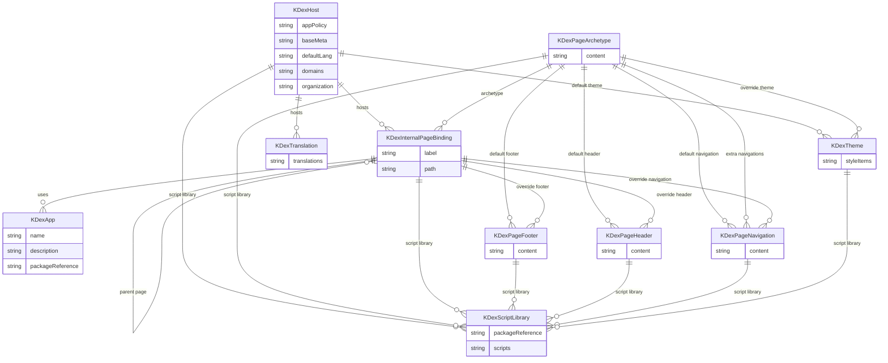

## CRD Relationships

See [CRD_REFERENCE.md](CRD_REFERENCE.md) for reference documentation.

```mermaid
erDiagram
    KDexApp {
        string name
        string description
        string packageReference
    }

    KDexHost ||--o{ KDexInternalPageBinding : "hosts"
    KDexHost ||--o{ KDexScriptLibrary : "script library"
    KDexHost ||--o{ KDexTheme : "default theme"
    KDexHost ||--o{ KDexTranslation : "hosts"
    KDexHost {
        string appPolicy
        string baseMeta
        string defaultLang
        string domains
        string organization
    }

    KDexPageArchetype ||--o{ KDexInternalPageBinding : "archetype"
    KDexPageArchetype ||--o{ KDexPageFooter : "default footer"
    KDexPageArchetype ||--o{ KDexPageHeader : "default header"
    KDexPageArchetype ||--o{ KDexPageNavigation : "default navigation"
    KDexPageArchetype ||--o{ KDexPageNavigation : "extra navigations"
    KDexPageArchetype ||--o{ KDexScriptLibrary : "script library"
    KDexPageArchetype ||--o{ KDexTheme : "override theme"
    KDexPageArchetype {
        string content
    }

    KDexInternalPageBinding ||--o{ KDexApp : "uses"
    KDexInternalPageBinding ||--o{ KDexInternalPageBinding : "parent page"
    KDexInternalPageBinding ||--o{ KDexPageFooter : "override footer"
    KDexInternalPageBinding ||--o{ KDexPageHeader : "override header"
    KDexInternalPageBinding ||--o{ KDexPageNavigation : "override navigation"
    KDexInternalPageBinding ||--o{ KDexScriptLibrary : "script library"
    KDexInternalPageBinding {
        string label
        string path
    }

    KDexPageFooter ||--o{ KDexScriptLibrary : "script library"
    KDexPageFooter {
        string content
    }

    KDexPageHeader ||--o{ KDexScriptLibrary : "script library"
    KDexPageHeader {
        string content
    }

    KDexPageNavigation ||--o{ KDexScriptLibrary : "script library"
    KDexPageNavigation {
        string content
    }

    KDexScriptLibrary {
        string packageReference
        string scripts
    }

    KDexTheme ||--o{ KDexScriptLibrary : "script library"
    KDexTheme {
        string styleItems
    }

    KDexTranslation {
        string translations
    }
```