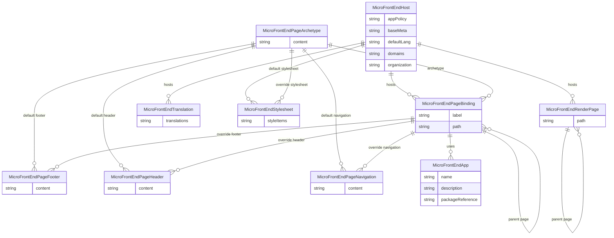

```mermaid
erDiagram
    MicroFrontEndHost ||--o{ MicroFrontEndPageBinding : "hosts"
    MicroFrontEndHost ||--o{ MicroFrontEndRenderPage : "hosts"
    MicroFrontEndHost ||--o{ MicroFrontEndTranslation : "hosts"
    MicroFrontEndHost ||--o{ MicroFrontEndStylesheet : "default stylesheet"

    MicroFrontEndPageArchetype ||--o{ MicroFrontEndPageBinding : "archetype"
    MicroFrontEndPageArchetype ||--o{ MicroFrontEndPageFooter : "default footer"
    MicroFrontEndPageArchetype ||--o{ MicroFrontEndPageHeader : "default header"
    MicroFrontEndPageArchetype ||--o{ MicroFrontEndPageNavigation : "default navigation"
    MicroFrontEndPageArchetype ||--o{ MicroFrontEndStylesheet : "override stylesheet"

    MicroFrontEndPageBinding ||--o{ MicroFrontEndApp : "uses"
    MicroFrontEndPageBinding ||--o{ MicroFrontEndPageFooter : "override footer"
    MicroFrontEndPageBinding ||--o{ MicroFrontEndPageHeader : "override header"
    MicroFrontEndPageBinding ||--o{ MicroFrontEndPageNavigation : "override navigation"
    MicroFrontEndPageBinding ||--o{ MicroFrontEndPageBinding : "parent page"

    MicroFrontEndRenderPage ||--o{ MicroFrontEndRenderPage : "parent page"

    MicroFrontEndApp {
        string name
        string description
        string packageReference
    }

    MicroFrontEndHost {
        string appPolicy
        string baseMeta
        string defaultLang
        string domains
        string organization
    }

    MicroFrontEndPageArchetype {
        string content
    }

    MicroFrontEndPageBinding {
        string label
        string path
    }

    MicroFrontEndPageFooter {
        string content
    }

    MicroFrontEndPageHeader {
        string content
    }

    MicroFrontEndPageNavigation {
        string content
    }

    MicroFrontEndRenderPage {
        string path
    }

    MicroFrontEndStylesheet {
        string styleItems
    }

    MicroFrontEndTranslation {
        string translations
    }
```
